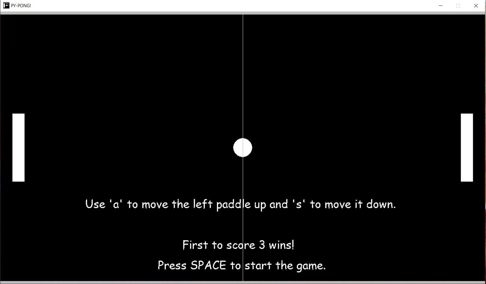
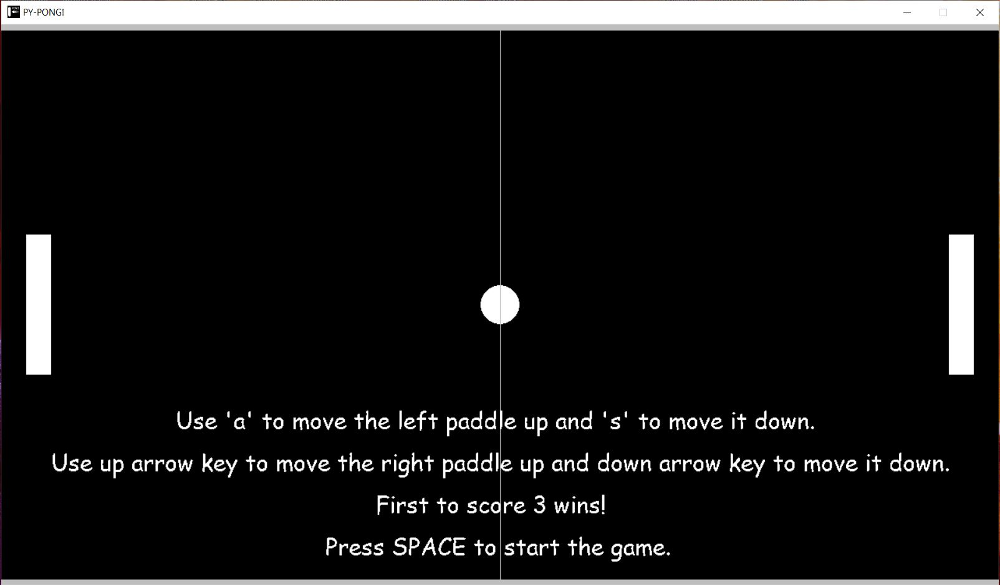

# 🏓Classic Pong game implemented in Python!

To run the app in default mode (vs AI) and difficulty (easy): <b><i>Python src/run.py</i></b>

To run the app in vs AI mode at higher difficulty setting (hard): <b><i>Python src/run.py --difficulty hard</i></b>

To run the app in 2-player mode: <b><i>Python src/run.py --mode 2p</i></b>

Include <b><i>--enable_sounds 1</i></b> to enable music and sounds-effects!